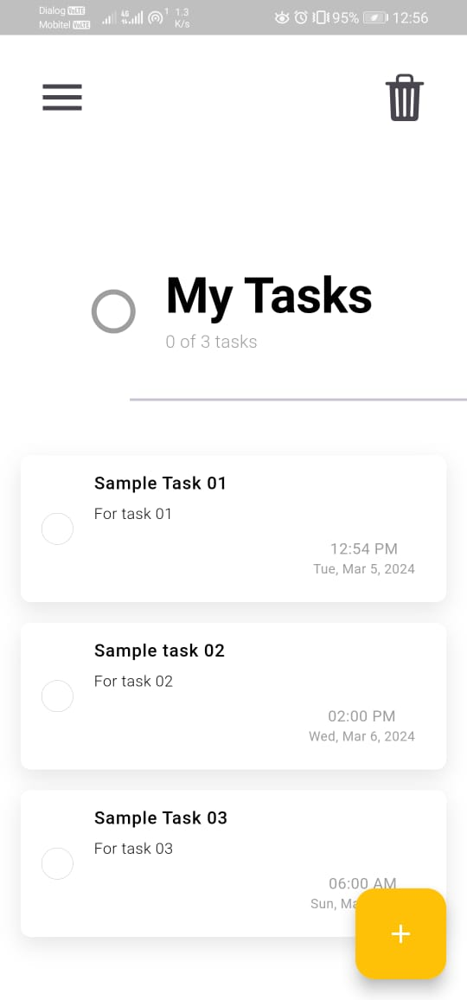
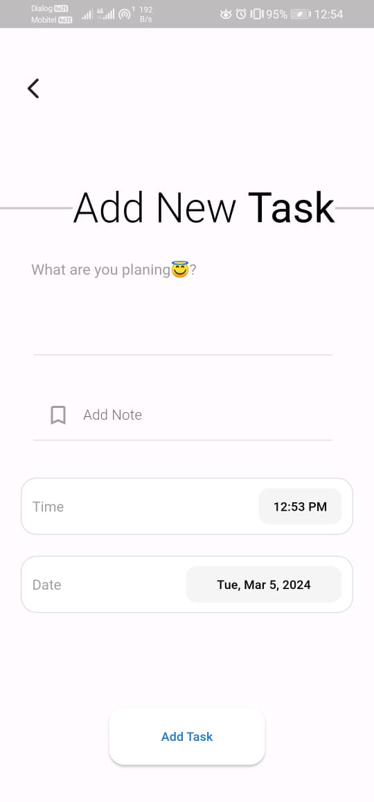
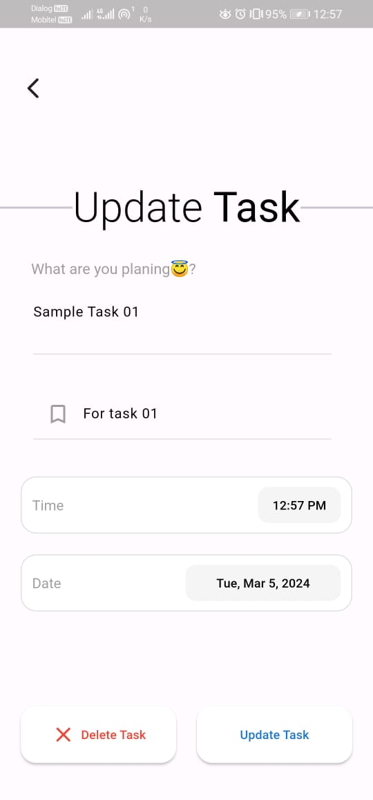
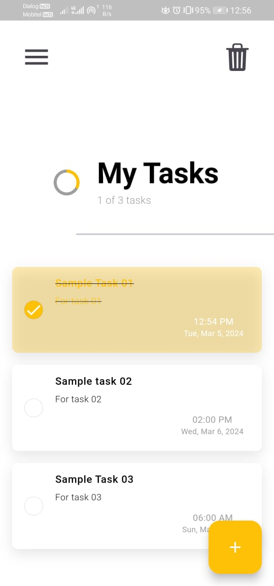
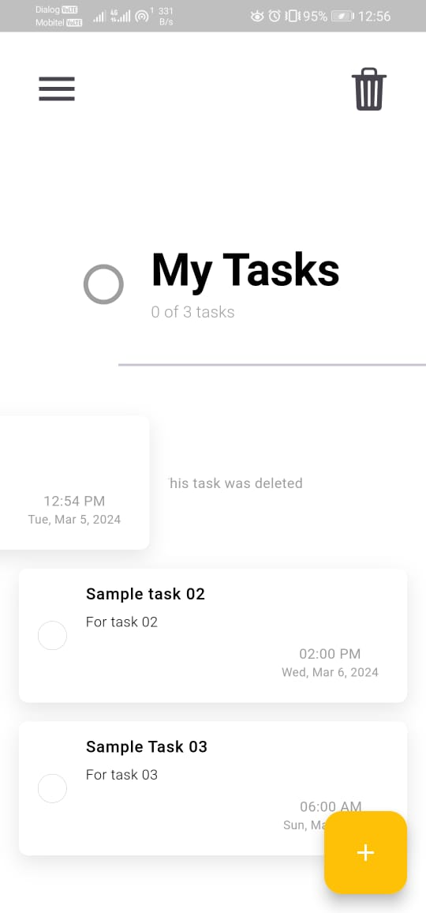
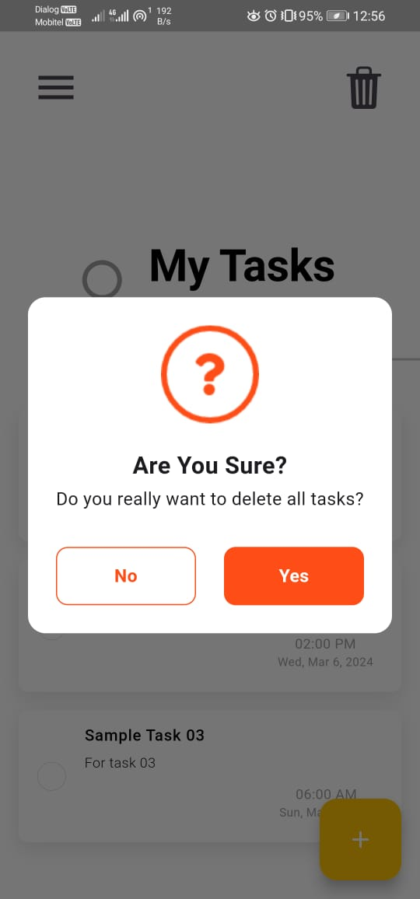
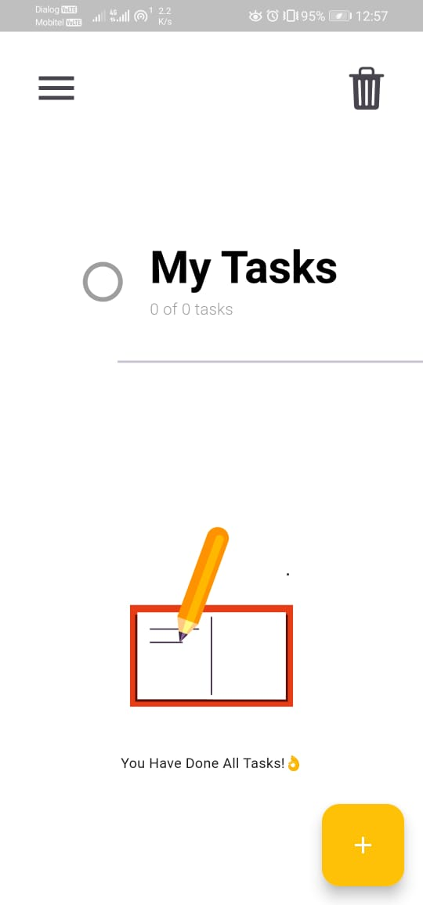
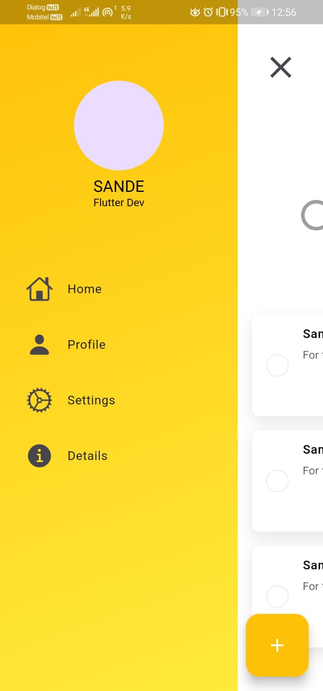

# Task Manager App

A simple user friendly task manager app built with Flutter that helps you organize your tasks efficiently.

## Features

- Add, edit, and delete tasks
- Mark tasks as complete
- Set due dates for tasks

## Screenshots

    
    
    
    
    
    
    
    

## Getting Started

To get started with the app, follow these steps:

1. Clone this repository:

    git clone https://github.com/EkanayakaSAND/task_file_manager

2. Navigate to the project directory:

    cd task-manager-app

3. Install dependencies:

    flutter pub get

4. Run the app:

    flutter run

## Dependencies

- [Flutter](https://flutter.dev/)
- [Provider](https://pub.dev/packages/provider) for state management
- [hive](https://hive.apache.org/) for local database

## Acknowledgements

  - This project was developed in the context of Faculty of Engineering, University of Ruhuna.
  - This project was developed in collaboration with ACSENEVIRATHNA(https://github.com/ACSENEVIRATHNA).
